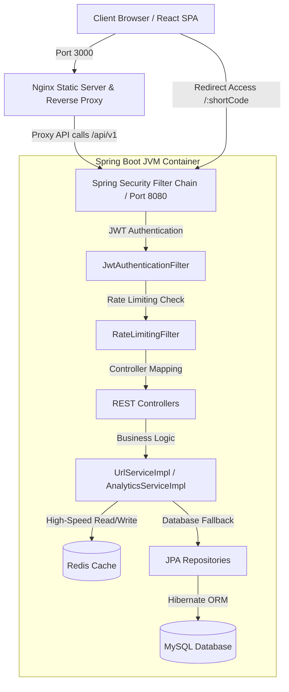
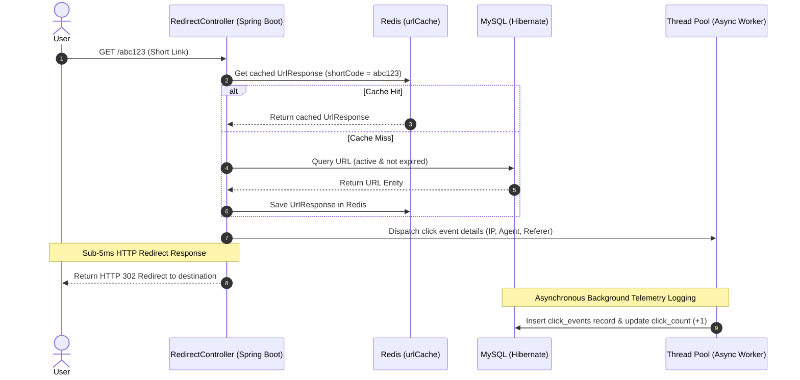
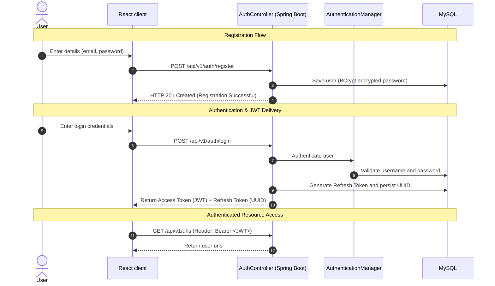

# Horizon: Enterprise URL Shortener & Analytics Platform

Horizon is a high-performance, secure, and production-ready URL shortener and real-time telemetry/analytics dashboard built on Spring Boot 3.x, React (Vite), Redis, and MySQL.

[](https://www.oracle.com/java/)
[](https://spring.io/projects/spring-boot)
[](https://react.dev/)
[](https://vitejs.dev/)
[](https://www.mysql.com/)
[](https://redis.io/)
[](https://jwt.io/)
[](https://opensource.org/licenses/MIT)
[](#)

---

### 🔗 Project Links
*   **Live Demo Interface**: *(Deploy to get your URL)*
*   **Production REST API**: *(Configured via `BACKEND_URL` environment variable)*
*   **Interactive Swagger Documentation**: `http://your-backend-host/swagger-ui.html`

---

##  Project Overview
Unlike simple CRUD-focused URL shorteners that perform direct database lookups for every request, **Horizon** is engineered from the ground up as a production-grade backend application designed to handle high-velocity link resolution. 

### Why Horizon?
In a standard web environment, querying database disks for every URL redirection introduces massive latency, disk I/O bottlenecks, and single-points-of-failure. Horizon resolves these scaling challenges by implementing:
1.  **Read/Write Segregation (Performance Isolation)**: Read requests (redirects) are handled in sub-5ms latency ranges via a distributed Redis lookup. Write requests (creation, updates, deletes) are isolated and synchronized using fail-safe invalidation routines.
2.  **Asynchronous Analytics Telemetry**: Redirect click logging, country/city detection, and user-agent analysis are decoupled from the main request thread and processed asynchronously, keeping redirect latencies extremely fast.
3.  **Strict Security Filtering**: Implements database-backed JWT blacklist refreshes, real-time user enablement checks, and rate-limiting structures to safeguard the platform against abuse.

###  Trade-offs & Design Choices
*   **Monolithic Architecture**: Chosen for simplicity, faster development iteration, and deployment ease.
*   **Redis as a Cache Only**: Configured purely as an ephemeral cache, not as the primary datastore, preserving clean relational integrity.
*   **MySQL Database**: Chosen for ACID-compliant transactional consistency and robust relational queries.
*   **JWT Stateless Authentication**: Chosen to eliminate backend session lookup overhead and simplify frontend storage.
*   **Separate Profiles**: Development and production configurations are separated to maintain clean credentials hygiene and environment-specific logging levels.
*   **Async Processing**: Telemetry analytics extraction is decoupled from link resolution to ensure minimal latency for the redirecting user.

---

##  Features

###  Authentication & Security
*   **Dual-Token Lifecycle**: Stateless JWT access tokens handle request validation. DB-backed UUID Refresh Tokens authorize access token renewal.
*   **Strict Account Enablement**: The security pipeline intercepts requests to check the `isEnabled` flag, enabling administrators to instantly block compromised accounts.
*   **BCrypt Verification**: Secure, salted password storage using BCrypt (strength 10) prevents credential exposure.
*   **Role-Based Security**: Restricts critical URL metrics and administration panels to users possessing `ROLE_ADMIN`.

### 🔗 URL Management
*   **Automatic Shortening**: Generates ultra-compact Base62 shortcodes.
*   **Custom Aliasing**: Allows users to specify readable custom vanity aliases.
*   **Flexible Expirations**: Configurable expiration timestamps or "Never Expires" options.
*   **State Control**: Instant activation and deactivation toggling of links.

###  Real-Time Analytics
*   **Redirect Telemetry**: Logs IP addresses, operating systems, browsers, and geolocations (country/city).
*   **High-Volume Telemetry**: Tracks click counts, last-access dates, and historical access profiles.
*   **User Analytics Modal**: Graphical charts displaying click trends over 1-day, 7-day, and 30-day windows.

###  Performance & Fail-Safe Architecture
*   **Write-Through Caching**: Redis caches URL details (`urlCache`) on first read to avoid subsequent database hits.
*   **Proactive Eviction**: Link updates, deletes, and custom alias changes trigger targeted cache invalidations.
*   **Fail-Open Redis Handling**: In the event of a Redis outage, all lookup and rate-limiting routines fail open to the database to ensure zero downtime.
*   **Sliding-Window Rate Limiting**: Distributed sliding-window checks block spam bots and brute-force register attempts.

###  Administration & Auditing
*   **Admin Dashboard**: Platform-wide metrics (total users, active links, redirect statistics, top URLs).
*   **User Management**: Enables admins to disable or enable accounts.
*   **System Audit Logging**: Records events (`USER_REGISTER`, `USER_LOGIN`, `URL_UPDATE`, `URL_DELETE`, `ADMIN_USER_DISABLE`) to audit logs.

---

##  Architectural Overview

### 1. Platform Topology
The application routes frontend requests through Nginx to isolate static asset delivery from the Spring Boot API:



### 2. High-Speed Redirect Sequence
Horizon segregates user redirects from background click telemetry tracking using asynchronous task executors:



### 3. Authentication & JWT Token Exchange Flow
Horizon handles secure user access through stateful credentials validation and stateless token queries:



---

##  Tech Stack

| Component | Technology | Version | Description |
| :--- | :--- | :--- | :--- |
| **Backend** | Java / Spring Boot | 17+ / 3.1.2 | Main JVM application framework. |
| **Frontend** | React / Vite | 18.x / 5.x | Responsive client SPA interface. |
| **Database** | MySQL | 8.0 | Relational database engine. |
| **Caching** | Redis | 7.x | High-performance sliding rate-limiter and read caching. |
| **Security** | Spring Security | 6.x | Security filter pipeline, CORS configuration, and JWT filter. |
| **Documentation**| OpenAPI / Swagger | 2.1.0 | Interactive API schema testing. |
| **Build Tool** | Maven / npm | 3.9+ / 10+ | Dependency resolution and bundle packaging. |
| **Deployment** | Docker / Compose / Nginx | — | Orchestration and static reverse proxy server. |

---

## 📁 Folder Structure

```text
├── .env.example                # Template for backend environment variables
├── pom.xml                     # Maven project descriptor
├── README.md                   # Enterprise documentation file
├── src/
│   ├── main/
│   │   ├── java/com/example/urlshortener/
│   │   │   ├── config/         # Security, CORS, OpenAPI, and Redis bean setup
│   │   │   ├── controller/     # Controllers exposing REST end-points
│   │   │   ├── dto/            # Input binding models and response wrappers
│   │   │   ├── entity/         # Database persistence entities
│   │   │   ├── exception/      # Global handler exceptions (Duplicate, NotFound)
│   │   │   ├── repository/     # Spring Data JPA database layers
│   │   │   ├── security/       # JWT extraction filters & custom rate limiters
│   │   │   └── service/        # Interface contracts & implementation classes
│   │   └── resources/
│   │       ├── application.properties      # Main routing properties
│   │       ├── application-dev.properties  # Development config (defaults)
│   │       ├── application-prod.properties # Secret-free production properties
│   │       ├── data.sql                    # Initial seed data
│   │       └── schema.sql                  # Fallback DDL schema creation script
└── frontend/
    ├── .env.example            # Template for frontend environment variables
    ├── .env.development        # Development environment vars (local dev proxy)
    ├── package.json            # Node project dependency manager
    ├── vite.config.js          # Vite asset pipeline configuration
    ├── nginx.conf              # Production Nginx reverse-proxy configuration
    └── src/
        ├── api/                # Custom Axios clients with HTTP status interceptors
        ├── components/         # Shared visual components (Form, List, Header)
        ├── pages/              # Primary router views (Dashboard, Admin, Home)
        └── index.css           # Curated Slate-Indigo design system styling sheet
```

---


##  Installation & Running

Horizon supports profile-specific configurations using Spring Profiles:
*   **`dev` (Development, default)**: Uses local development defaults (local Redis, local DB credentials) and logs detailed SQL executions.
*   **`prod` (Production)**: Requires all database credentials, Redis hosts, and JWT secrets to be supplied strictly via environment variables.

### Option 1: Direct Local Setup (Development Mode)

#### 1. Prerequisites
- Java 17+, Maven 3.9+, Node.js 20+
- Running MySQL 8.0 instance with database `url_shortener` created
- Running Redis 7.x instance

#### 2. Configure Local Variables
Copy `.env.example` to `.env` and set your local database credentials.

#### 3. Run Backend
```bash
mvn clean spring-boot:run
```

#### 4. Run Frontend
```bash
cd frontend
npm install
npm run dev
```
Frontend dev server starts at `http://localhost:3000` with proxy to backend.

### Option 2: Docker Compose

Orchestrate the entire platform (MySQL + Redis + Backend + Frontend Nginx):
```bash
# Create a .env file from the example and fill in required values
cp .env.example .env
# Edit .env with your JWT_SECRET and DB_PASSWORD at minimum
docker compose up --build
```
The frontend Nginx is exposed on port `3000`. Access via `http://localhost:3000/`.

### Option 3: Cloud Deployment (Railway / Render / Fly.io / VPS)

See the [Cloud Deployment Guide](#-cloud-deployment) section below.

---

## ☁️ Cloud Deployment

### Prerequisites
1. A managed MySQL 8.0 database (PlanetScale, Railway MySQL, Amazon RDS, etc.)
2. A managed Redis instance (Railway Redis, Upstash, etc.)
3. A cloud hosting account (Railway, Render, Fly.io, or a VPS)

### Deployment Steps

#### Backend (Spring Boot)
1. Set `SPRING_PROFILES_ACTIVE=prod` in your hosting platform's environment variables.
2. Configure all required environment variables (see table below).
3. Deploy using the root `Dockerfile` — it builds the Spring Boot JAR and starts the server.

#### Frontend (React/Vite/Nginx)
1. Set `VITE_API_BASE_URL` build argument to your backend API URL if deploying separately:
   - Docker Compose (Nginx proxy): `/api/v1`
   - Separate backend deployment: `https://your-backend-host.com/api/v1`
2. Deploy using `frontend/Dockerfile` — it builds the Vite bundle and serves via Nginx.

### One-Click Deployment (Docker Compose on VPS)
```bash
git clone https://github.com/vinaykatnur/url-shortener.git
cd url-shortener
cp .env.example .env
# Edit .env with production values
nano .env
docker compose up -d --build
```

---

## 🔑 Environment Variables

### Backend
| Variable Name | Profile | Default (dev) | Description |
| :--- | :--- | :--- | :--- |
| `SPRING_PROFILES_ACTIVE` | All | `dev` | Active Spring profile (`dev` / `prod`). |
| `DB_URL` | `prod` | local MySQL URL | MySQL database connection JDBC URL. |
| `DB_USERNAME` | `prod` | `root` | Database user credential. |
| `DB_PASSWORD` | `prod` | *(empty)* | Database password credential. |
| `REDIS_HOST` | `prod` | `localhost` | Redis server host address. |
| `REDIS_PORT` | `prod` | `6379` | Redis server connection port. |
| `REDIS_PASSWORD` | `prod` | *(empty)* | Redis authentication password. |
| `REDIS_SSL` | `prod` | `false` | Enable TLS for Redis connection. |
| `JWT_SECRET` | `prod` | *(dev secret)* | Secret key for signing JWTs (min 32 chars). Generate with `openssl rand -hex 32`. |
| `JWT_ACCESS_TOKEN_EXPIRATION_MS` | All | `900000` | Access token TTL in ms (default: 15 min). |
| `JWT_REFRESH_TOKEN_EXPIRATION_MS` | All | `2592000000` | Refresh token TTL in ms (default: 30 days). |
| `FRONTEND_URL` | `prod` | `http://localhost:3000` | Frontend URL for CORS configuration. |
| `PORT` | `prod` | `8080` | HTTP port the backend listens on. |

### Frontend
| Variable Name | Required | Default | Description |
| :--- | :--- | :--- | :--- |
| `VITE_API_BASE_URL` | Recommended | `/api/v1` | Base URL for all API requests. Set at Docker build time via `--build-arg`. |

---

## 🌐 API Documentation

All API responses are wrapped in a standard JSON envelope:
```json
{
  "success": true,
  "message": "Operation completed successfully",
  "data": { ... }
}
```

### 1. Authentication Endpoints
*   `POST /api/v1/auth/register` - Creates a new user account.
*   `POST /api/v1/auth/login` - Validates credentials; returns access token (JWT) + refresh token (UUID).
*   `POST /api/v1/auth/refresh` - Generates a new access token using a valid refresh token.
*   `POST /api/v1/auth/logout` - Revokes refresh tokens.

### 2. URL Management
*   `POST /api/v1/urls` - Shortens a new link. Accepts custom alias and expiration details.
*   `GET /api/v1/urls` - Paginated lists of URLs belonging to the authenticated user.
*   `PUT /api/v1/urls/{id}` - Mutates destination URL, custom alias, or expiration date.
*   `DELETE /api/v1/urls/{id}` - Permanently evicts a link.

### 3. Telemetry & Analytics
*   `GET /api/v1/analytics/my-urls` - Accesses paginated click summaries.
*   `GET /api/v1/analytics/top-urls` - Returns the top 10 URLs on the platform *(Admin only)*.
*   `GET /api/v1/analytics/dashboard` - Platform-wide statistics overview *(Admin only)*.

### 4. Admin Management
*   `PUT /api/v1/admin/users/{id}/disable` - Toggles account state (`isEnabled`).

---

## 🔒 Security Architecture

### Why JWT?
*   **Stateless authentication**: Eliminates server-side session state overhead.
*   **Easy frontend integration**: Standardized token-based verification stored on the client and appended to Axios headers.
*   **Suitable for REST APIs**: Promotes decentralized and horizontal scaling of resources.

### Why Refresh Tokens?
*   **Improve security**: Limits access token lifetime (short duration) to mitigate exposure risk if intercepted.
*   **Reduce login frequency**: Allows clients to automatically renew active access tokens without prompt interfaces.

### Why Rate Limiting?
*   **Prevent abuse and brute-force attacks**: Shields the registration, login, and redirection endpoints from malicious traffic.

### Why Audit Logs?
*   **Track security-sensitive actions**: Records administrative operations (disabling accounts, URL mutation logs) for system auditing.
*   **Improve traceability**: Connects events to user accounts and subject IDs for security accountability.

---

##  Performance Optimizations

### Why Redis?
*   **Reduce repeated database reads**: Caches hot link destinations, avoiding disk reads for static mapping values.
*   **Improve redirect performance**: Redis caching minimizes database access for popular URLs, improving responsiveness under repeated access.
*   **Cache frequently accessed URLs**: Keeps high-traffic routes hot, mitigating database connection exhaustion.

### Why Async Analytics?
*   **Redirect users immediately**: Resolves the HTTP 302 location header immediately back to the client browser.
*   **Record analytics without blocking the request**: Analytics events are processed asynchronously after the redirect so the user's request is not delayed.

### Database Indexing
*   **Double-Indexed Relational Data**: High-velocity search columns are structured with database indexes:
    *   `idx_urls_short_code` for shortcode lookups.
    *   `idx_urls_custom_alias` for custom vanity resolving.
    *   `idx_click_events_url_id` to aggregate statistics.

---

##  Production Readiness
*   **Profile-Based Operations**: Uses Spring Boot profiles to separate development and production properties.
*   **No Hardcoded Secrets**: Production configs require database passwords and keys to be injected via environment variables.
*   **Error Masking**: Errors are processed by global exception handlers to return standard JSON envelopes rather than raw Java stack traces.
*   **Input Binding Validation**: All requests are validated against validation constraint schemas (`@Email`, `@Size`, `@Pattern`) before reaching the service layer.

---

##  Challenges & Lessons Learned
During development, several production-oriented challenges were identified and resolved:
*   **Improved JWT authentication** by separating registration from login.
*   **Fixed legacy expiration handling** by migrating epoch-based values to `null`.
*   **Standardized date serialization** using ISO-8601 to avoid frontend timestamp inconsistencies.
*   **Added Redis cache invalidation strategies** to keep cached data consistent.
*   **Introduced environment-specific configuration** using Spring profiles for secure deployment.
*   **Improved audit logging** by capturing successful and failed authentication events.

---

##  Future Enhancements
*   **QR Code Utilities**: Auto-generate QR codes for shortened links.
*   **Custom Domain Routing**: Support custom user domains.
*   **Password Protection**: Allow users to lock redirect links behind password gates.
*   **API Key Management**: Expose developer credentials so teams can integrate URL shortening directly into external scripts.
*   **Geographical Visualization**: Render maps of click telemetry inside the React user interface.

---


---

## Author

**Vinay Katnur**
